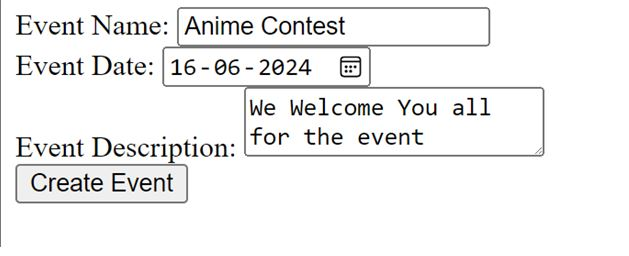

# Event Manager

This is a Node.js server application that allows you to create, read, update, and delete (CRUD) event details, which are stored in a MySQL database. The application includes an HTML form to input event information.

## Prerequisites

Before you begin, ensure you have the following installed on your machine:

- [Node.js](https://nodejs.org/)
- [MySQL](https://www.mysql.com/)
- [Git](https://git-scm.com/)

## Project Structure

event-manager/
│
├── server.js
├── package.json
└── package-lock.json

## Getting Started

Follow these instructions to set up and run the project locally.

### Step 1: Clone the Repository

Clone this repository to your local machine using:

git clone https://github.com/your-username/event-manager.git

Navigate to the project directory:

cd event-manager

### Step 2: Set Up the MySQL Database
Open your MySQL client and run the following SQL queries to set up the database:

CREATE DATABASE event_manager;
USE event_manager;

CREATE TABLE events (
  id INT AUTO_INCREMENT PRIMARY KEY,
  name VARCHAR(225) NOT NULL,
  date DATE NOT NULL,
  description TEXT
);
Update the database connection settings in server.js to match your MySQL credentials:

const db = mysql.createConnection({
  host: 'localhost',
  user: 'your-username', // Use your MySQL username
  password: 'your-password', // Use your MySQL password
  database: 'event_manager'
});

### Step 3: Install Dependencies
Install the required Node.js packages using:
npm install

### Step 4: Run the Server
Start the server with the following command:

node server.js
The server will be running on http://localhost:3000/.

## Features
Create Event: Fill out the HTML form to create a new event.
Read Events: View all events stored in the database.
Update Event: Update an existing event using its ID.
Delete Event: Delete an event using its ID.

## API Endpoints
GET /: Displays the HTML form for creating an event.
POST /events: Creates a new event.
GET /events: Retrieves all events.
PUT /events/:id: Updates an event by ID.
DELETE /events/:id: Deletes an event by ID.

## License
This project is licensed under the MIT License.

## Contributing
Contributions are welcome! Please feel free to submit a pull request.

## Contact
If you have any questions, feel free to reach out at shree150902@gmail.com.
This README provides a clear overview of the project's setup, structure, and usage.
